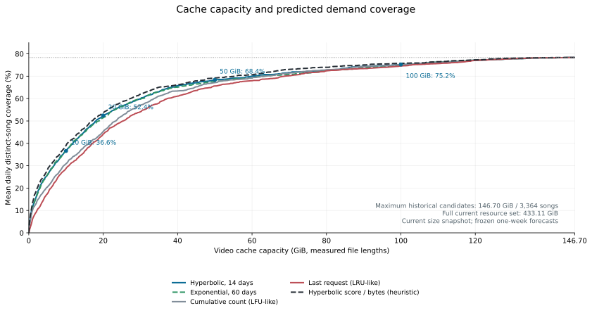

# Still Wanna Dance

**简体中文** | [English](README.en.md)

**Load failed? But I still wanna dance!**

Still Wanna Dance 是为 **Windows 上的 VRChat WannaDance 玩家**打造的开源本地视频缓存工具。把播放过的视频留在本机，提前准备房间里接下来要跳的歌曲，再通过一个简单的网页控制台查看下载、管理缓存。

解压即可运行，支持 Windows 托盘，无需安装 Go、Node.js 或数据库。

[查看发布版本](https://github.com/SW26010/still-wanna-dance/releases) · [使用指南](docs/console.md) · [反馈问题](https://github.com/SW26010/still-wanna-dance/issues)

## 为跳舞准备好视频

- **让缓存派上用场**：已有完整缓存时从本机读取，减少重复下载；首次播放支持边下边播，同时保存视频。
- **提前准备待播歌曲**：读取 VRChat 日志中的房间队列，默认预缓存前 3 个位置的有效曲目，也可以按需调整数量。
- **看得见的下载进度**：在控制台查看活动下载、上游速度、最近请求和队列准备情况，方便判断视频是否已经就绪。
- **按自己的空间安排缓存**：选择存储目录、搜索和删除缓存、检查文件完整性；设置视频容量上限后，自动优先清理低优先级视频。
- **灵活选择网络连接**：支持播放地址 API 参数选择（Auto、node=cf、node=nya），资源以 API 实际返回的域名集合为准，以及内置加密 DNS 直连或 SOCKS5 代理。
- **按需准备曲库**：可以扫描本地库存、校验已有视频，或下载补齐曲库，适合希望提前准备的玩家。

## 快速开始

面向 Windows x64。先准备一个可写的程序目录，以及足够存放视频的磁盘空间。

1. 在[发布页面](https://github.com/SW26010/still-wanna-dance/releases)查找 Windows portable ZIP，完整解压后双击 `still-wanna-dance-console.exe`。如果暂时没有发布包，也可以[从源码构建](#从源码构建)。
2. 程序会打开本地网页控制台。首次使用时，阅读并确认使用条款。
3. 在「设置」中选择存储目录，保存后点击「立即重启并应用」。VRChat 日志目录默认自动识别，通常无需手动填写。
4. 回到「开始使用」，点击「启用游戏加速」，按提示完成 hosts 接入；修改 hosts 时会出现 Windows 授权提示。
5. 进入 WannaDance 并请求一首歌曲，在「开始使用」查看接入与请求状态，在「运行状态」和「本地缓存」页查看下载及缓存情况。

需要提前缓存时，在「准备歌曲」中的「房间队列预缓存」点击开启；它与 CDN 独立启停。建议在点歌前开启队列预缓存，让它有时间准备。首次下载仍取决于上游速度和本机网络；「开始使用」「收到请求」表示请求已到达本地服务，实际播放情况以游戏内为准。接入后未收到请求时，可以尝试重进世界或重启游戏刷新 DNS。

同意条款后，关闭网页程序仍在托盘运行；可以从托盘重新打开控制台，也可以在页脚点击「退出整个应用」或从托盘退出。未同意时，关闭条款页会尝试在 60 秒后自动退出，重新打开可取消。退出会停止所有服务和后台任务，但不会恢复 hosts 映射。

**停用或卸载前，请先在控制台点击「恢复 hosts」。** 关闭服务或退出程序不会自动恢复 hosts，保留映射可能影响之后的直连播放。

更详细的操作见[本地控制台](docs/console.md)和[便携版说明](docs/portable-readme.txt)。

## 按你的习惯使用

| 想做什么 | 去哪里 |
| --- | --- |
| 开始使用、检查游戏是否接入 | 「开始使用」 → 启用游戏加速 |
| 查看速度、下载进度和最近请求 | 运行状态 |
| 查找缓存、释放空间、查看请求统计 | 本地缓存 |
| 检查缺失视频、下载补齐 | 准备歌曲 |
| 修改目录、容量上限、线路或代理 | 设置 |
| 调整待播歌曲的预缓存数量 | 设置 → 队列预缓存数量（保存并重启应用） |
| 独立开启或关闭队列预缓存 | 准备歌曲 → 房间队列预缓存 |

控制台里的「本地 CDN」就是运行在你电脑上的缓存服务。日常使用通过网页和托盘完成，也提供[独立命令行入口](docs/service.md)供自定义部署。

## 使用前了解这些

- **缓存面向游戏的 HTTP 播放链路。** 网页 HTTPS 播放保持原站加密连接并透传，不读取或填充本地视频缓存。支持 node=cf/node=nya 播放接口，暂不支持 SHA。资源域名不与节点名称绑定，也不预设固定名单，见[资源域名规则](docs/resource-domains.md)。
- **已有缓存能应对部分上游故障。** 播放地址解析失败时，程序可以使用该歌曲上次确认且校验通过的本地视频；这不等于完整离线模式，也不覆盖后续下载失败。详见[本地降级边界](docs/service.md#本地降级边界)。
- **磁盘占用可以管理。** 视频容量默认不限；全曲库下载可能占用大量空间，建议先设置合适的上限。播放和下载中的文件可能使实际占用暂时超过上限。
- **项目仍在持续完善。** 已有自动化测试和历史实机验证记录；当前存储及播放 API 等改动仍需补充完整的 VRChat 联合验收。不同网络与播放器环境的体验，欢迎通过 Issue 分享。具体兼容情况见[功能范围](docs/scope.md)。

## 从源码构建

Windows 桌面版需要 Go 1.25 或更新版本、Git 和 PowerShell。在仓库目录执行：

```powershell
.\scripts\build-desktop.ps1
.\bin\still-wanna-dance-console.exe
```

网页资源和 SQLite 依赖会编译进程序，无需额外搭建前端或数据库服务。

开发环境、测试命令见[开发指南](docs/development.md)；生成可分发的 ZIP 见[打包说明](docs/packaging.md)。

## 一起完善

欢迎提交 Bug、分享使用体验、提出功能建议，或直接发起 Pull Request。文档改进、界面体验和不同网络环境下的测试反馈都很有帮助。

[提交 Issue](https://github.com/SW26010/still-wanna-dance/issues) 时，建议附上程序版本、Windows 版本、使用线路、操作步骤，以及预期和实际结果。需要分享日志时，请先检查并移除个人路径等不希望公开的信息。

## 更多文档

| 文档 | 内容 |
| --- | --- |
| [本地控制台](docs/console.md) | 网页操作、托盘、游戏接入与网络设置 |
| [队列预缓存](docs/queue-prefetch.md) | 提前准备待播歌曲的方式与设置 |
| [缓存容量管理](docs/cache-retention.md) | 保留优先级、容量上限与自动清理 |
| [缓存收益研究](docs/research/cache-priority.md) | 历史需求回测、评分公式与空间预算的覆盖收益 |
| [命令行服务](docs/service.md) | 独立启动、参数和缓存行为 |
| [统一存储](docs/storage.md) | 视频、歌曲资料与统计的存放方式 |
| [功能范围](docs/scope.md) | 支持范围、兼容限制与验证依据 |
| [测试与验收](docs/test-results.md) | 测试记录与结果说明 |
| [开发指南](docs/development.md) | 开发环境、代码入口与测试命令 |

## 从 StepStash 升级

Still Wanna Dance 是本项目的新名称。如果你使用的是已采用当前统一存储格式的 StepStash，退出旧程序并备份配置与存储目录后，将新程序放回原目录即可沿用配置和缓存；升级后需要重新确认条款。

更早的旧存储格式和原版歌曲库暂不支持迁移，请使用新的空存储目录并保留旧数据。详细步骤见[便携版升级说明](docs/portable-readme.txt)。

## 缓存空间与覆盖收益

更多缓存通常能覆盖更多歌曲，但新增空间的收益会逐渐降低。以下回测使用 15,186 次历史记录，在每个切分前计算评分并固定缓存集合，预测随后一周；横轴按参考视频库的**实际完整文件大小**计算容量，共享视频只占一份空间。纵轴是每天去重后的歌曲覆盖率。

总图范围为 **0—146.70 GiB**，对应 11 个评估切分点中最大的历史候选集合：3,364 首歌曲、3,284 个可映射的唯一视频。到达该范围上限后，每个评估周都已纳入全部历史候选资源，继续扩容不会增加本次回测的覆盖率。



本研究首选**两周双曲线评分**，兼顾公式简洁与覆盖表现。它在 **20 GiB 约覆盖 52.44%，50 GiB 约覆盖 68.38%，100 GiB 约覆盖 75.23%**；从 50 增至 100 GiB，额外 50 GiB 只增加约 6.86 个百分点。当前参考库的全部唯一视频约为 433.11 GiB。提前填充缓存还需要首次下载这些文件，若已经在本地则无需重复下载；图中覆盖率不能直接换算成实测网络节省或播放加速。

这是单个观察者、11 个有效留出周及当前文件大小快照下的估算；图中约 78% 的平台来自“只选择历史出现过歌曲”的候选限制，并非缓存技术的覆盖上限。图里的研究评分也不表示当前程序已采用这些公式。方法、30 天稳定性、预热代价与局限见[完整研究文章](docs/research/cache-priority.md)。

## 开源许可与内容使用

本项目采用 [MIT 许可证](LICENSE)，欢迎使用、修改和贡献。第三方依赖许可见[第三方声明](THIRD-PARTY-NOTICES.txt)。

软件开源许可不包含视频、音乐等第三方内容的授权。请仅在具有必要授权或其他合法依据时使用相关内容，并阅读[使用条款与内容权利声明](internal/legal/TERMS.txt)。仓库不包含视频、原版二进制或完整游戏日志。
