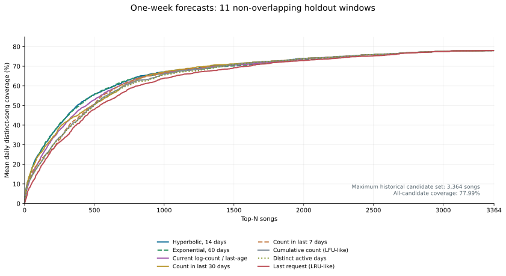
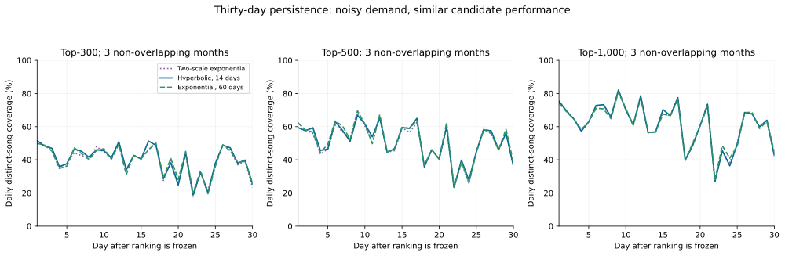
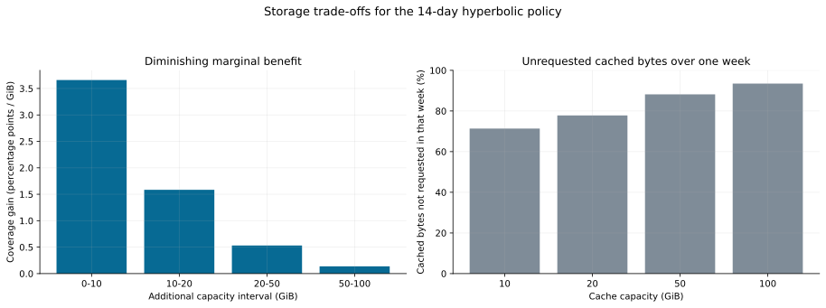

# 从歌曲热度到缓存收益：基于滚动时间切分的本地视频缓存优先级研究

> 数据与大小快照：2026-10-04。本文研究固定缓存集合对未来需求的覆盖能力，给出算法选择与空间预算的实证依据；它不构成当前程序已采用这些公式的声明。

## 摘要

视频缓存的价值不能仅由保存歌曲的数量衡量：歌曲大小不同，需求随时间变化，扩大缓存也会增加磁盘占用和提前下载成本。本文基于 15,186 次合并去重记录、3,492 首歌曲，采用扩展历史的时间切分，在切分前计分并冻结排名，预测随后一周的平均每日去重歌曲覆盖率，同时考察最长 30 天的覆盖变化。初始比较及后续探索共形成 313 个最终候选方案。温和时间衰减相对累计次数、最近请求排序和短时间窗口有较清晰的收益，而两周双曲线、60 天单指数及双尺度混合的差异较小。进一步将歌曲关联到实际视频文件，以完整文件累计字节而非歌曲数量作为容量约束。在当前大小快照下，两周双曲线的 20、50、100 GiB 缓存预算分别覆盖约 52.44%、68.38%、75.23% 的未来每日不同歌曲，显示边际收益递减。结果支持优先选择简单、可解释的评分规则，并将算法复杂度、空间预算、预热成本及评估指标一并考虑。

**关键词：** 视频缓存；需求预测；时间衰减；滚动回测；容量约束；边际收益。

## 1. 研究问题与指标选择

对于 WannaDance 的本地视频缓存，问题可以分为两层：

1. **需求排序：** 仅根据时刻 $T$ 之前的观测，哪些歌曲最值得预先保留？
2. **资源分配：** 在给定磁盘预算下，这些歌曲对应的完整视频能覆盖多少未来需求？

两者相关，但并不等价。相同的 Top-500 集合可能占用不同空间；同样的 20 GiB 也可能容纳不同数量的歌曲。另一方面，反复请求同一首歌会提高事件命中率，却未必增加当天可跳的歌曲种类。因此，本文采用**当天去重后的歌曲覆盖率**作为主指标，不对点歌人实施等权归一化。训练端的部分公式仍累加历史请求；评估端同一首歌在同一天始终只贡献一个观测单位。

缓存研究长期关注时间局部性、频率以及不同对象的大小和回源成本。例如，GreedyDual-Size 将对象大小与取回成本纳入置换决策；TinyLFU 则使用近期频率信息进行准入判断。这些工作说明，频率、时效性与成本是不同维度的决策信息。[Cao 与 Irani，1997](https://www.usenix.org/conference/usits-97/cost-aware-www-proxy-caching-algorithms)；[Einziger 等，2015](https://arxiv.org/abs/1512.00727)。本文的累计次数与最近请求排序只是**冻结排名的 LFU/LRU 式对照**，未实现或评估这些论文的在线算法。

## 2. 数据与文件大小关联

### 2.1 需求记录

记录来自 VRCX、原始 VRChat 日志以及 DanceTrail 的可识别 WannaDance 请求或播放信号。仅使用可解析的歌曲 ID 和时间；合并时沿用既有去重规则：同来源同歌曲 30 秒窗口去重，跨来源约 60 秒窗口检查重叠，原始日志中的播放开始仅在附近没有请求信号时补充。队列同步等诊断消息不作为新的需求。

| 项目 | 数量或范围 |
| --- | --- |
| 合并去重记录 | 15,186 次 |
| 不同歌曲 | 3,492 首 |
| 观察起止，上海时间 | 2025-07-07 18:51:00 至 2026-10-03 21:36:23 |
| 原始日志文件 | 149 份 |
| 最后部分日期 | 2026-10-03，排除在评估完整日期之外 |

这些记录是单个观察者及其进入房间的样本，不能代表全平台的歌曲分布。请求也不等于确认完成播放；同一歌曲的快速重复可能被去重窗口合并。

### 2.2 文件大小与共享资源

大小参考目录为 `D:\still-wanna-dance\stepstash-data`。通过 `current_videos` 与 `video_versions` 将歌曲映射到当前资源，再读取 `videos/<资源指纹>.mp4` 的普通文件长度。此次快照中，10,398 个歌曲映射对应 10,076 个唯一资源，文件均存在，实际长度与数据库 `file_bytes` 全部一致，合计 **433.11 GiB**。文件中位数为 **44.80 MiB**，第 5、95 百分位分别为 **13.42、76.27 MiB**。

历史记录中，3,491/3,492 首歌曲、15,185/15,186 次记录能关联到当前资源大小；对应 3,406 个唯一资源，合计 151.91 GiB。不能映射的歌曲不进入容量准入集合，但仍保留在未来覆盖率的分母中。共享资源只收费一次；如果某首未来歌曲与已缓存歌曲指向同一资源，则在当前映射假设下也可被覆盖。

公开的[大小快照](cache-priority/size-snapshot.json)仅含歌曲 ID、匿名资源编号、文件长度及来源标志，不含标题、视频内容、资源指纹、私人路径或点歌人身份。匿名资源编号用于保留共享关系，不代表歌曲 ID。

**时间边界：** 大小与歌曲—资源关系是 2026-10-04 的当前快照，未重建每个历史切分时的版本及曲库可得性。因此，容量分析回答的是“用当前文件大小计价，这些历史预测集合需要多少空间”，属于回溯性成本估算。它不能证明当时已经存在这些版本，或当时实际下载了相同字节数。

## 3. 时间切分与统计定义

### 3.1 扩展历史与留出期

所有切分均按上海时间午夜进行，历史集合为 $\mathcal H_T=\{(s_i,t_i):t_i<T\}$。在 $T$ 计算一次分数，随后一周或 30 天不更新排名。训练历史不断扩展，不只使用最近一段；时间窗口对照对窗口外记录赋零分，再按累计次数等同分规则补位。

初始简单公式比较使用 2025-09-01 起、2026 年 7 月前完整结束的 41 个有效一周开发窗口。后续学习方法在 4 月前的窗口拟合，在 4—6 月的 12 个一周窗口及 9 个完整 30 天窗口做内部验证。早期拟合样本上的学习模型指标不作为独立验证证据。

主要后期评估使用 2026-07-06 至 09-21 的 **11 个互不重叠有效周**；07-13 整周无记录，排除。30 天评估在 07-01、08-01、09-01 固定切分，得到 **3 个不重叠窗口**。另有 12 个重叠滚动 30 天窗口，仅作为敏感性对照。整个研究共保留 59 个切分点的样本量信息。

### 3.2 每日去重歌曲覆盖率

记未来第 $d$ 天观测到的不同歌曲集合为 $U_{T,d}$，时刻 $T$ 评分最高的前 $N$ 首历史歌曲为 $A_T(N)$。定义：

$$
C_{T,d}(N)=\frac{|U_{T,d}\cap A_T(N)|}{|U_{T,d}|}.
$$

无记录日期视为缺测，不填零。先在每个窗口的有效日内平均，再对窗口等权平均：

$$
\bar C(N)=\frac{1}{K}\sum_{T}\frac{1}{|D_T|}\sum_{d\in D_T} C_{T,d}(N).
$$

其中 $D_T$ 是有观测的日期集合。这使一个记录较少的有效周仍具有与其他周相同的总权重，故也报告排除有效日少于 4 天的周、以及直接对全部有效日等权平均的敏感性结果。主要对照的优势方向保持一致。

曲线面积必须说明积分范围。本文以 $N=0\ldots1000$ 的归一化梯形面积为初始排序目标：

$$
\operatorname{AUC}_{L}=\frac{1}{L}\sum_{n=1}^{L}\frac{\bar C(n-1)+\bar C(n)}{2},\qquad L=1000.
$$

单看 Top-3000 会掩盖头部排序差异；面积和多个固定 $N$ 的覆盖率应共同报告。

### 3.3 覆盖率衰减与不确定性

每个 30 天窗口分别计算首 7 天与末 7 天平均覆盖率，定义下降量：

$$
\Delta_T(N)=\operatorname{mean}_{d=1\ldots7} C_{T,d}(N)
-\operatorname{mean}_{d=24\ldots30} C_{T,d}(N).
$$

缺测日期仍排除；再对窗口平均。正值表示下降，负值表示末周更高。该指标描述冻结集合面对变化需求的表现，**不是评分函数自身的衰减常数**。首周基准、末周水平及全月平均也必须同时查看。

一周方法差值采用 11 个不重叠周的配对 bootstrap，重复 10,000 次、固定随机种子 20261004。相邻周仍可能相关，区间可能偏窄；跨多个参数搜索后出现的最高观察值也存在选择偏差。3 个月度窗口不足以支撑精确的衰减排名。

## 4. 候选评分规则

记 $a_i=(T-t_i)/\text{一天}$，$c_s$ 为历史次数，$\ell_s$ 为距最近一次请求的天数。核心对照为：

| 方法 | 歌曲分数 | 解释 |
| --- | --- | --- |
| 累计次数，LFU 式 | $c_s$ | 长期频率，无年龄衰减 |
| 累计活跃天数 | 出现过歌曲的不同日期数 | 降低同日重复的影响 |
| 最近请求，LRU 式 | 最近请求时间 | 只考虑最后出现顺序 |
| 最近 $w$ 天次数 | $\sum_i\mathbf1(a_i\le w)$ | 窗口外零分，使用共同同分补位规则 |
| 研究时的旧运行时公式 | $\ln(1+c_s)/(1+\ell_s/7)$ | 将累计次数整体按最后请求时间衰减 |
| 单指数 | $E_h(s)=\sum_i2^{-a_i/h}$ | 每条记录独立衰减，$h$ 为半衰期 |
| 双曲线 | $H_\tau(s)=\sum_i(1+a_i/\tau)^{-1}$ | 每条记录独立衰减，较长尾部 |

共同的同分规则依次为历史次数较多、最近出现较晚、歌曲 ID 较小。它是本实验确定性的辅助排序，不代表程序实际淘汰的所有同分细节。

初始开发集选出的双尺度为：

$$
S(s)=0.25\frac{E_{14}(s)}{\sum_uE_{14}(u)}
+0.75\frac{E_{120}(s)}{\sum_uE_{120}(u)}.
$$

它需要两个时间尺度和一个混合系数。后续搜索增加了逐日计数、幂律、不同窗口、每日总权重归一化、多尺度权重学习、自适应选公式以及监督树模型，共形成 313 个最终方案；多尺度学习另外进行了约 3,000 次训练期权重试验。更复杂的方法应由独立数据中的可确认收益支持，而不是仅由某一次最高点支持。

## 5. 结果一：常见方法之间有差距，优秀的简单公式之间差距很小



**图 1.** 11 个有效留出周的平均每日去重歌曲覆盖率；所有排名在切分时冻结。横轴为 0—3,364 首，达到评估周中最大的历史候选集合。LFU/LRU 式曲线是预测对照，不能直接解释为在线缓存命中率。

| 方法 | Top-100 | Top-300 | Top-500 | Top-1000 | AUC₀…₁₀₀₀ |
| --- | ---: | ---: | ---: | ---: | ---: |
| 两周双曲线 | 25.04% | 44.17% | 55.82% | 67.07% | 50.07% |
| 60 天单指数 | 24.93% | 44.14% | 55.76% | 66.45% | 49.94% |
| 双尺度混合 | 25.00% | 44.16% | 55.81% | 67.12% | 50.12% |
| 当前真实需求公式 | 21.01% | 41.50% | 52.86% | 66.79% | 48.06% |
| 最近 30 天次数 | 24.43% | 41.80% | 50.53% | 67.10% | 47.74% |
| 最近 7 天次数 | 21.28% | 38.09% | 50.90% | 66.38% | 46.63% |
| 累计次数 | 19.42% | 37.69% | 50.63% | 66.10% | 45.88% |
| 累计活跃天数 | 19.58% | 37.34% | 50.45% | 65.60% | 45.54% |
| 最近请求排序 | 16.27% | 34.18% | 47.97% | 63.84% | 43.31% |

两周双曲线相对累计次数的 Top-300 覆盖率增加 **6.49 个百分点**；相对最近请求排序增加 **9.99 个百分点**。在面积指标上，两周双曲线对累计次数和最近请求排序均在 11 个留出周全部胜出；对累计次数的面积提升为 4.20 个百分点，配对区间约为 [3.63, 4.77]。这支持将频率与时间局部性共同纳入评分。

然而，双尺度相对两周双曲线只提高 **0.05 个百分点**面积，区间约为 [-0.03, 0.12]；相对 60 天单指数只提高 0.19 个百分点，区间跨零。双曲线时间尺度取 7、14、30 天时，后期面积分别为 49.91%、50.07%、49.82%，呈现较宽的平台。这些结果支持简单的整齐时间尺度，不能据此证明某个具体参数是普遍最优值。

后续 313 个方案中，后期面积最高的观察值为自适应方案的 50.39%，相对固定双尺度只增加 0.27 个百分点，区间约为 [-0.02, 0.52]。该最高值是在比较完后期结果后报告的探索性排名，不能倒推为一次全新独立验证。监督模型亦只有小幅提升。本文因而不将“参数搜索更多”视为“泛化更好”的证据。

到 Top-3000，三种优秀公式均约为 **77.52%**。扩大选择集合后，更多模型开始包含相同的历史歌曲，排序差异被稀释。纯歌曲排名的全部历史候选覆盖上限约为 77.99%；此前未出现的歌曲仍计入分母并视为未覆盖。这是候选集合的边界，不是缓存系统的技术上限。

**横轴的有意义上限。** 11 个评估切分点的历史候选由 2,971 首增加至 3,364 首，故总图取 $N_{\max}=3,364$；到达该点时，每个周窗口均已纳入全部历史候选，所有排序方法达到相同平台。全部观察期虽然共有 3,492 首，但其中部分歌曲在这些切分之后才首次出现，不能用于扩大历史可选集合。超过 3,364 的曲线只会继续保持平台，无法提供额外的排序或扩容证据。

## 6. 结果二：较小下降量并不自动意味着更耐用



**图 2.** 各相对日期在有效月窗口上的平均覆盖率，基于 3 个不重叠 30 天窗口。有效窗口数随缺测变化，逐日曲线有明显噪声；房间、歌曲偏好和新歌比例变化共同影响结果。

| 前 N 首 | 双尺度下降 | 两周双曲线下降 | 60 天单指数下降 |
| ---: | ---: | ---: | ---: |
| 100 | 4.23 | 4.35 | 4.58 |
| 300 | 4.32 | 4.50 | 4.46 |
| 500 | 4.18 | 5.02 | 5.74 |
| 1000 | 7.05 | 7.26 | 6.35 |

下降量单位为百分点。Top-500 看似由双尺度占优，但加入绝对水平后，解释发生变化：

| 方法，Top-500 | 首周覆盖率 | 末周覆盖率 | 全月平均 |
| --- | ---: | ---: | ---: |
| 双尺度 | 55.31% | 51.13% | 53.02% |
| 两周双曲线 | 56.15% | 51.13% | 53.50% |
| 60 天单指数 | 56.73% | 51.00% | 53.64% |

双尺度的起点更低，末周却几乎相同，其较小下降量并未转化为更高的全月覆盖。不同月份也并非一致下降，例如两周双曲线 Top-500 在 7 月末周较首周增加约 1.54 个百分点，而在 8、9 月分别下降约 5.22、11.38 个百分点。因此，应同时报告覆盖水平、下降量及不同窗口的一致性，不应仅最小化衰减指标。

## 7. 结果三：以字节计价后，缓存体现出明显的边际收益递减

### 7.1 从 Top-N 到完整文件预算

记歌曲当前对应资源为 $r(s)$、资源完整文件长度为 $b_r$。资源集合 $V$ 的代价为：

$$
B(V)=\sum_{r\in V}b_r.
$$

每个切分仍只对此前出现过的歌曲评分，沿歌曲排名提取第一次出现的资源，得到资源顺序；这等价于按一个资源所关联历史歌曲的最高分排序。只取累计大小不超过预算 $B$ 的**最长完整前缀**，遇到下一文件放不下时停止，不跳过它选择后面的更小文件。不按文件大小估算歌曲编号，也不把共享文件收费两次。

未来一天的容量覆盖率为：

$$
C^{\mathrm{bytes}}_{T,d}(B)=\frac{\sum_{s\in U_{T,d}}\mathbf1\{r(s)\in V_T(B)\}}{|U_{T,d}|}.
$$

无法映射大小、未进入候选的需求仍计入分母。由于共享资源可覆盖其他歌曲 ID，资源口径与纯歌曲集合口径略有差别；全部历史候选资源的平均覆盖平台约为 **78.36%**，而不是直接沿用前节的 77.99%。


**图 3.** 横轴为容量预算 GiB，准入门槛由当前快照的实际完整文件长度决定，实际占用不超过预算。总图范围为 0—146.70 GiB，精确终点为 146.698836904 GiB：它是 11 个切分点中最大的历史候选资源总大小，对应 3,364 首歌曲中可映射的 3,363 首及 3,284 个唯一视频。各周的完整候选资源大小为 130.31—146.70 GiB，因此达到总图终点后，各周都已纳入全部可选资源；继续扩容不再改变本实验的覆盖率。点线平台由历史候选限制产生；433.11 GiB 是当前完整资源集的大小参照，未作为各历史时刻可实施的全曲库下载策略加入预测曲线。

| 视频预算 | 两周双曲线覆盖率 | 60 天指数 | 累计次数 | 双曲线 / 字节启发式 |
| ---: | ---: | ---: | ---: | ---: |
| 5 GiB | 25.84% | 25.90% | 20.46% | 28.08% |
| 10 GiB | 36.60% | 36.61% | 30.87% | 38.98% |
| 20 GiB | 52.44% | 51.40% | 45.27% | 53.66% |
| 30 GiB | 59.87% | 59.75% | 57.06% | 61.95% |
| 50 GiB | 68.38% | 67.63% | 67.16% | 69.20% |
| 100 GiB | 75.23% | 74.78% | 75.23% | 75.77% |

在 20 GiB 预算处，两周双曲线比累计次数增加 **7.17 个百分点**，11 个周窗口全部胜出，配对区间约为 [5.75, 8.68]；比最近请求排序增加约 8.32 个百分点。于是，“按歌曲数看起来接近”并不意味着“小容量下经济性没有区别”。但两周双曲线与单指数仍总体接近，个别预算处的小差异不宜扩大解释。

就两周双曲线而言：

- 0—10 GiB：平均每增加 1 GiB 增加约 **3.66 个百分点**覆盖率。
- 10—20 GiB：约 **1.58 个百分点/GiB**。
- 20—50 GiB：约 **0.53 个百分点/GiB**。
- 50—100 GiB：约 **0.14 个百分点/GiB**。

这些是给定区间的平均增益，不是曲线在每一点都具有同样导数，也不构成预算选择的普遍阈值。平均 Top-300、Top-1000、Top-3000 的两周双曲线集合分别约需 14.49、46.84、131.89 GiB；这进一步说明单纯歌曲数量不能直接替代磁盘预算。

### 7.2 单位空间收益与目标冲突

若用 $q_r$ 表示历史评分的资源优先级，可以构造 $q_r/b_r$ 排序，优先保留单位空间分数高的资源。它是容量启发式，**不是对 0—1 背包问题最优解的证明，也不是 GreedyDual-Size 的完整实现**。本实验按资源关联历史歌曲的最高分形成 $q_r$，仍采用同一最长前缀准入。

这一方法在 20 GiB 处将去重歌曲覆盖率从 52.44% 提高到 53.66%，但它对较小文件的偏好带来目标差异。若改用完整视频大小加权的覆盖代理，20 GiB 处普通双曲线约为 **53.95%**，分数/字节约为 **52.18%**。更多歌曲种类被覆盖，并不自动意味着更多传输字节被避免。

这里的大小加权指标定义为每日不同歌曲的文件大小命中占比，只是资源需求的代理；请求可能涉及 Range、重复播放或未完整播放，不能将它当成实测网络节省。容量扩展及分数/字节方法是在原有留出数据上追加的探索性分析，需要新的时间段继续检验。

### 7.3 提前下载的代价与按需缓存的区别



**图 4.** 两周双曲线的区间边际增益，以及所选完整缓存资源中一周内未被观测请求的字节比例。后者不表示永久浪费，也不等于缓存维护总成本。

在 20、50、100 GiB 预算下，约 **77.81%、88.17%、93.50%** 的选中缓存字节在随后一周未出现观测请求。覆盖率可以很高，同时短观察期内大部分缓存没有被访问：一首热门歌可在许多日期贡献覆盖，缓存却必须同时容纳大量可能被请求的不同资源。较长观察期或其他房间可能使用这些文件，故不能将未使用比例称为无效下载率。

提前预热完整视频的首次下载成本约与所选文件总长度一致；若文件已在本地，这部分网络成本已经发生。之后每次本地读取可能避免取回相应数据，但实际收益取决于请求范围、重复次数、视频版本与网络条件。与**完全不缓存**相比，避免重复下载是缓存的收益；与**已经按需缓存**相比，提前预热主要改变首次请求的等待及下载时机，不能把所有后续命中都归因于预热。本文没有模拟动态按需缓存或测量播放延迟，因此不报告这两类因果差值。

## 8. 对工程选择的含义

本研究的工程首选是**两周双曲线**：$H_{14}(s)=\sum_{i:s_i=s}(1+a_i/14)^{-1}$。理由是公式简单、主要覆盖指标较好、相对常见基线有一致收益，而更复杂公式的额外收益较小。“两周”指历史记录的评分时间尺度，不是缓存只能保留两周；第 6 节独立考察了冻结排名后的 30 天表现。该选择也不意味着双曲线在所有预算、月份和指标上唯一最优：60 天指数总体接近，现有月度样本不足以证明某一种公式的覆盖衰减普遍最小。

聚合数据的 `selection_audit` 保留早期回测按原有内部验证规则选出的双尺度方案，已标记为 `early_benchmark_selection`；它是历史选型记录。本文最终工程首选另记于 `article_recommendation`，不追溯改写早期验证结论，也不表示获得了新的独立验证。

1. **以两周双曲线作为默认研究方案。** 若增量更新成本更重要，60 天指数是表现接近的替代：它可只维护每首歌的衰减累计值及更新时间；双曲线通常需要历史记录或按时间桶聚合。
2. **优先按空间预算评估。** 预算应以完整唯一资源字节计量，不能用 Top-N 或平均文件大小粗略替代。共享视频是额外的空间收益来源。
3. **将覆盖水平与衰减同时报告。** 起点低可能制造较小下降量；末周水平和全月均值更能说明集合是否仍有用。
4. **明确收益目标。** 去重歌曲覆盖、请求命中、字节节省及播放等待属于不同效用。偏好小文件可以提高歌曲覆盖，未必改善字节或等待收益。
5. **避免把预测曲线视为运行承诺。** 活动播放、下载、队列保护和版本变化会影响实际保留集合。本文的固定集合不包含这些机制。

当前程序的真实需求评分、初始先验及共享资源处理见[缓存容量管理](../cache-retention.md)，实际存储与保护行为见[统一存储](../storage.md)。研究本身未修改运行时或默认容量；后续工程实现选择了表现接近、可常数空间增量更新的 60 天半衰期单指数，内置初始表也采用该公式。本文的研究推荐与历史回测结果保持不变；固定集合覆盖估计不等于动态缓存的在线收益验证。

## 9. 局限与进一步验证

主要局限是观察者及房间选择偏差、缺测日期、请求与完成播放的差异、去重窗口误差，以及当前文件快照对历史版本成本的近似。短样本的配对区间不能消除所有时序依赖；大量候选和追加分析也会产生选择偏差。密度启发式与更复杂学习模型需要新的时间段验证。

未来应以资源级完整请求序列进行在线缓存仿真，将预热与按需缓存区分，分别测量歌曲覆盖、真实传输字节、首次播放等待和磁盘写入；同时重建历史版本大小及曲库可得性。在缺少这些数据时，本文结论限定为当前快照下的固定集合覆盖估计。

## 10. 公开产物与复现

文章、SVG、大小快照、聚合数据和生成脚本均纳入 Git。私人原始记录与本地运行依赖仍在被忽略的目录中。

| 产物 | 内容 |
| --- | --- |
| [study-data.json](cache-priority/study-data.json) | 按周、模型及容量聚合的曲线、统计量、样本量与评估定义 |
| [size-snapshot.json](cache-priority/size-snapshot.json) | 歌曲—匿名资源映射及完整文件长度 |
| [extract-sizes.mjs](../../scripts/cache-priority-study/extract-sizes.mjs) | 只读 SQLite 及普通文件属性，提取大小快照 |
| [build-study.py](../../scripts/cache-priority-study/build-study.py) | 从本地去身份事件及既有回测重新生成文章用聚合数据 |
| [render-study.py](../../scripts/cache-priority-study/render-study.py) | 仅根据公开聚合数据重绘全部 SVG |
| [requirements.txt](../../scripts/cache-priority-study/requirements.txt) | 本次图表构建使用的 Python 依赖版本 |

仅重绘公开图表，无需私人日志：

```powershell
python -m pip install -r scripts/cache-priority-study/requirements.txt
python scripts/cache-priority-study/render-study.py
```

持有本地原始资料时，重新提取大小并生成聚合数据：

```powershell
node scripts/cache-priority-study/extract-sizes.mjs `
  'D:\still-wanna-dance\stepstash-data' `
  docs/research/cache-priority/size-snapshot.json

python scripts/cache-priority-study/build-study.py `
  --events artifacts/ranking-backtest/events.local.json `
  --benchmark artifacts/ranking-backtest/results.json `
  --common-curves artifacts/ranking-backtest/common-candidates-comparison.json `
  --sizes docs/research/cache-priority/size-snapshot.json `
  --output docs/research/cache-priority/study-data.json

python scripts/cache-priority-study/render-study.py
```

提取器本次使用 Node.js 24.19.0 的只读 SQLite 接口；Python 数值与渲染版本见依赖文件。重新扫描活动目录会得到新的大小快照，可能不再与本文固定快照完全相同。公开聚合数据足以重绘图表，**不足以反推或完整重建私人请求序列**；日志级独立复现仍需要原始资料。

原始事件规范化载荷的 SHA-256 为 `54e8dbc507b93dbc273c54dbd4e82f4899d0bdb112381c976be299d19020f573`；当前大小快照载荷的 SHA-256 为 `29de4ccbbae5fbe307b28f4a25720e20cef47fab765f6a7cabe137630faf7d5c`。生成过程检查容量不超预算、共享资源唯一计费、覆盖率单调性、完整候选平台，以及 30 天统计与既有回测的一致性。

## 参考文献

1. Cao, P., & Irani, S. (1997). *Cost-Aware WWW Proxy Caching Algorithms*. USENIX Symposium on Internet Technologies and Systems. [论文与会议记录](https://www.usenix.org/conference/usits-97/cost-aware-www-proxy-caching-algorithms)。
2. Einziger, G., Friedman, R., & Manes, B. (2015). *TinyLFU: A Highly Efficient Cache Admission Policy*. arXiv:1512.00727. [作者预印本](https://arxiv.org/abs/1512.00727)。
3. Still Wanna Dance. [视频缓存优先级与上限](../cache-retention.md)、[统一存储](../storage.md)，当前仓库中的实现说明。
